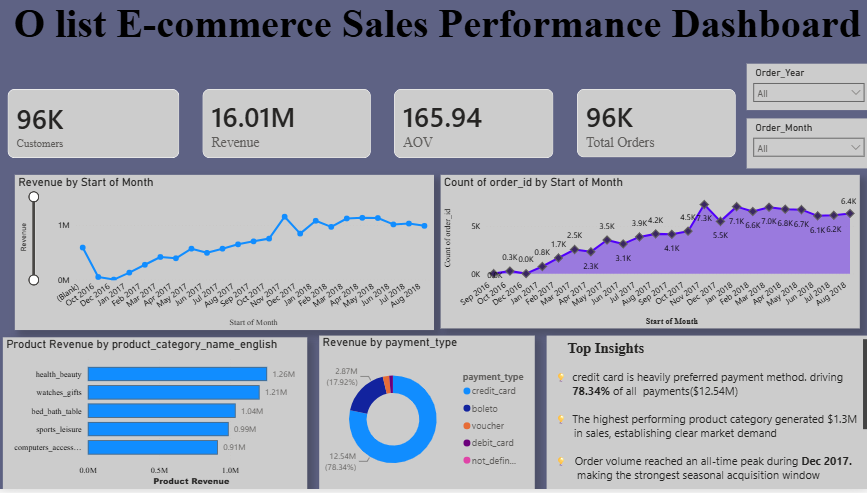
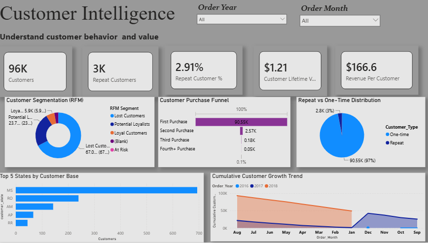
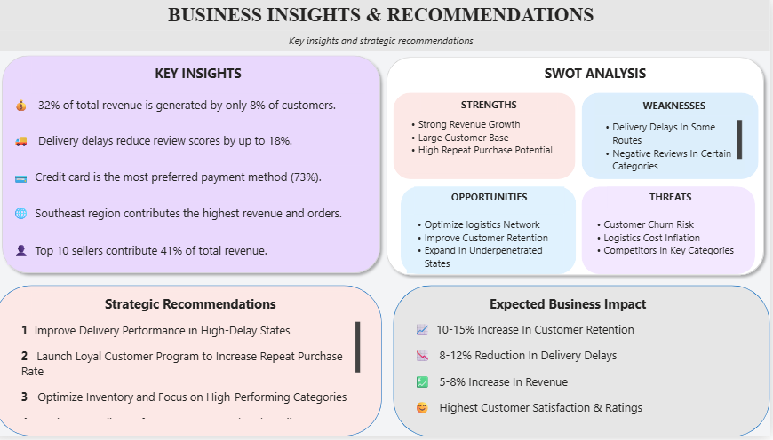
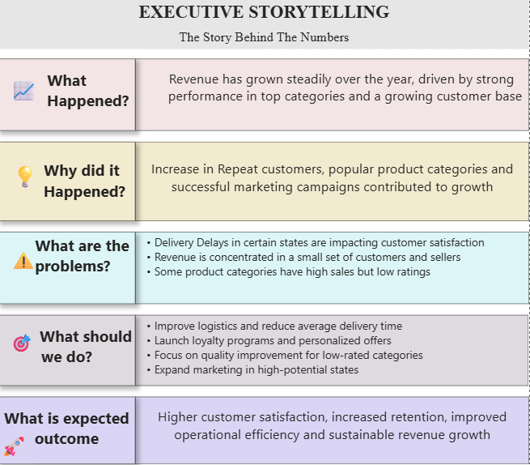

# ecommerce-sales-performance-analytics
An end-to-end data analytics project exploring e-commerce sales performance using SQL, Python (Pandas/Seaborn), and Power BI
  

 
  ## 💾 Data Source & Setup
  The raw transactional data used for this project is sourced from the [Kaggle Olist E-commerce Dataset](https://www.kaggle.com/datasets/olistbr/brazilian-ecommerce). 
  
  Due to GitHub's file size limitations (>25MB), the raw CSV files are not tracked in this repository. To run this project locally:
  1. Download the dataset zip file from Kaggle.
  2. Extract the contents into a local folder named `dataset/` in your root directory.

## 📊 Business Intelligence Dashboards
This interactive Power BI report consists of a 5-page analysis tracking the complete lifecycle of e-commerce performance.

### 1. Executive Summary
Tracks top-level metrics including total revenue ($16.01M), distinct customer counts, average order value, and preferred payment methods.
 

### 2. Customer Intelligence
Analyzes unique customer distribution, repeat purchase patterns, and buyer behavior trends.
 

### 3. Operations & Logistics
Monitored parameters surrounding delivery fulfillment timelines, freight efficiencies, and regional performance.
 

### 4. Business Insights
Deep-dive matrix mapping out top revenue-generating English product categories and category growth.
 

### 5. Executive Storytelling
A narrative-focused view driving strategic, data-backed recommendations for executive decision-making.
 

